## 1) ¿Qué diferencia observa entre el caso de estudio 1 y 2?

En el caso 1 la diferencia que observamos es que el emisor (NodeTx) envia paquetes mucho mas rapido de lo que el receptos (NodeRx) 
puede procesar, entonces el buffer del receptor se va a llenar a tal punto que va empezar a perder paquetes.
Para el caso 2 vuelve a pasar que el emisor envia paquetes mas rapido, pero esta vez el problema esta en el buffer (queue) que procesa los paquetes mas lento
por ende el buffer llega a su tamaño maximo y este empieza a dropear paquetes.

### Caso 1:
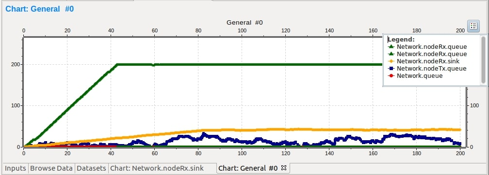

### Caso 2:
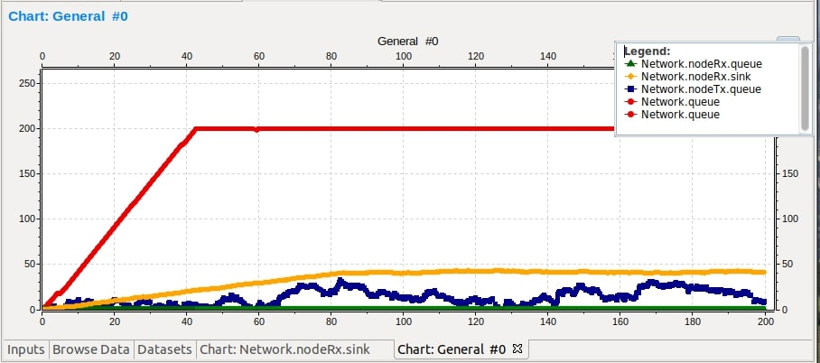

## 2) ¿Cuál es la fuente limitante en cada uno?

En el caso 1 la fuente limitante es el receptos (NodeRx), donde su datarate de recepcion es la mitad del emisor (NodeTx).

En el caso 2 la fuente limitante es el buffer (queue), donde su datarate de recepcion es la mitad del emisor (NodeTx).

### Exponencial(0,1)
#### Se generan 1979 paquetes y llegan 978, habiendo una perdida de 981 paquetes.

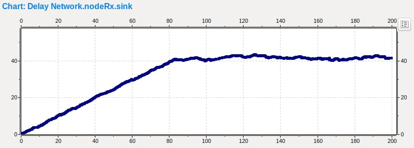
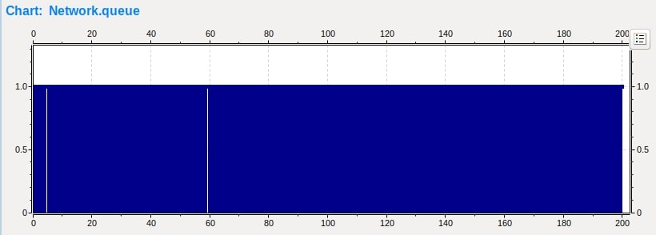
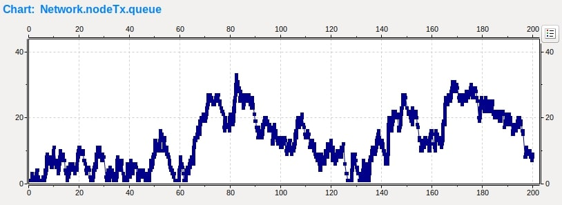

### Exponencial(0,3)
#### Se generan 659 paquetes y llegan 655, habiendo una perdida de 4 paquetes.

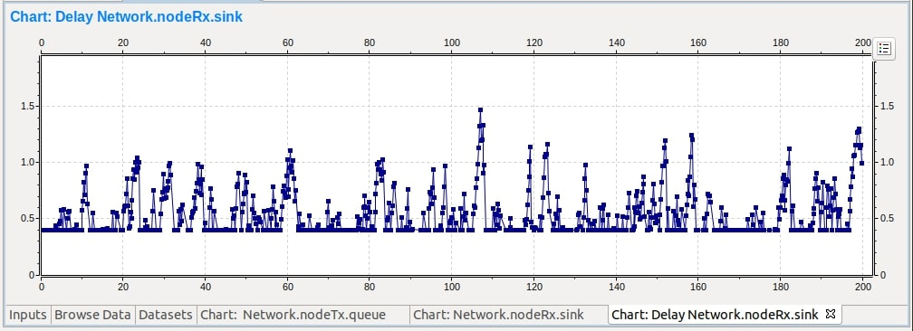
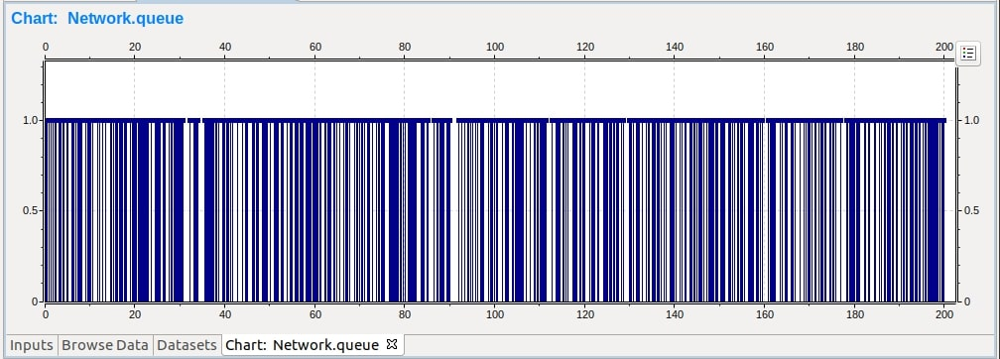
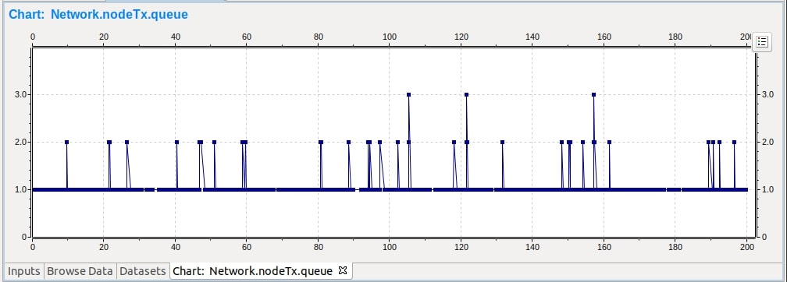

### Exponencial(0,5)
#### Se generan 390 paquetes y llegan 389, habiendo una perdida de 1 paquetes.

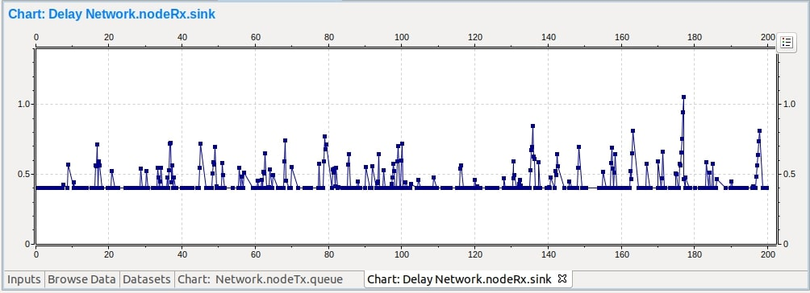
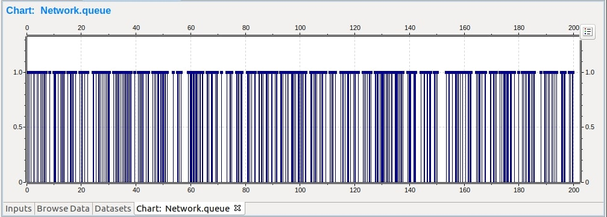
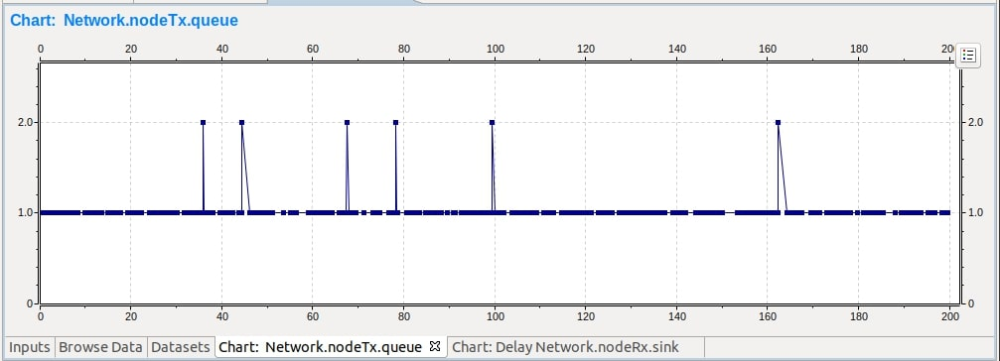

### Exponencial(0,6)
#### Se generan 326 paquetes y llegan 324, habiendo una perdida de 2 paquetes.

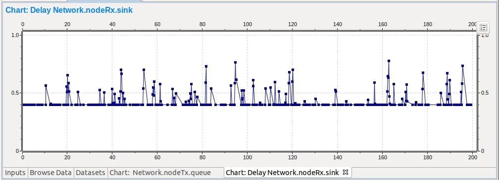
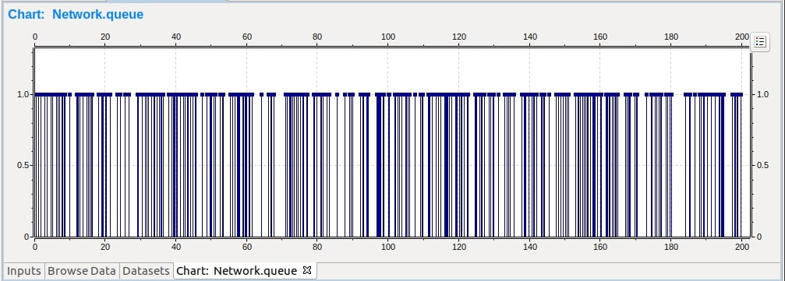
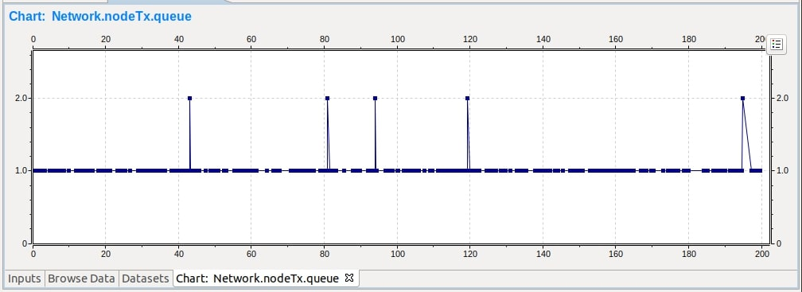

### Exponencial(0,65)
#### Se generan 299 paquetes y llegan 299, no hay perdidas de paquetes.

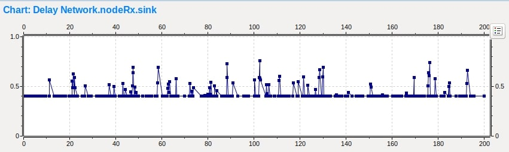
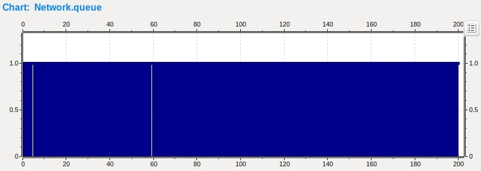
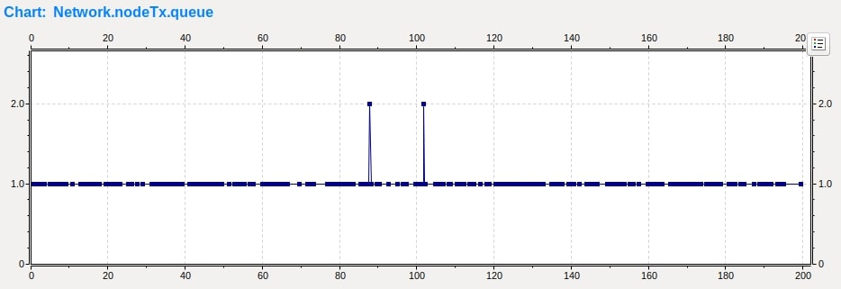

### Exponencial(1)
#### Se generan 200 paquetes y llegan 200, no hay perdidas de paquetes.

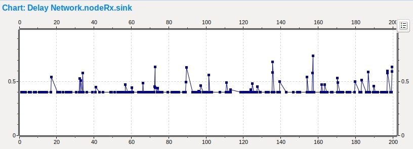
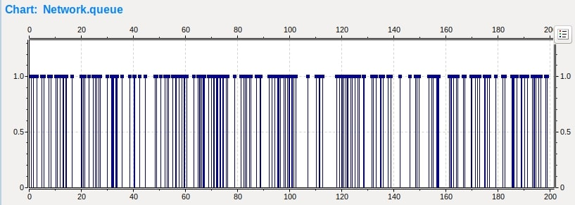
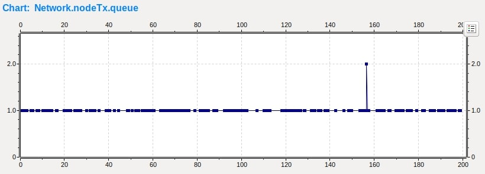

### Investigue sobre la diferencia entre control de flujo y control de congestión:

#### Control de Congestión:

Hace referencia al control del tráfico de entrada hacia una red de telecomunicaciones para evitar un colapso por congestión. Consiste en reducir la tasa de envío de paquetes de datos para disminuir la congestión en el receptor.

#### Control de Flujo:

El control de flujo es el proceso de gestionar la tasa de transmisión de datos entre dos nodos. El objetivo de esto es prevenir que un transmisor rápido exceda a un receptor lento. 
Provee mecanismos para que el receptor controle la velocidad de transmisión, haciendo que el nodo receptor no se sature con los datos entrantes. El control de flujo debe distinguirse 
del control de congestión, el cual es usado para controlar el flujo de datos cuando la congestión ya está ocurriendo. Éste es muy importante porque un emisor puede llegar a enviar 
datos mucho más rápido de lo que un emisor puede recibirlos y procesarlos, ya que puede generar pérdida de información.

## Casos de Implementación:

## ¿Cómo cree que se comporta su algoritmo de control de flujo y congestión?

Nuestro algoritmo funciona de modo que cuando un buffer (ya sea el de nodeRx o de queue) llega al 80% de su capacidad manda un paquete que viaja hasta
el nodo transmisor para que este disminuya su velocidad de transmicion, luego si el nodo transmisor disminuye mucho su velocidad, haciendo que la cantidad de paquetes del buffer
reseptor disminuya, este manda un paquete que aumenta la velocidad del nodo transmisor (si esta habia sido disminuida anteriormente).

## ¿Funciona para el caso de estudio 1 y 2 por igual? ¿Por qué?

El algoritmo fuciona igual en ambos casos, con la unica diferencia de que el buffer que se satura es el de nodeRx en el caso 1 y de queuePacketData en el caso 2.
Esto se genera por como estan seteadas las tasas de transferencias de datos en los diferentes casos, generando cuellos de botella en nodos distintos. 

### Exponencial(0,1)
### Caso 1:

En este caso nuestro buffer transRx se empieza a llenar hasta que llega al 80% de su capacidad, en ese momento se manda un paquete 
de control para disminuir la velocidad en la que se generan paquetes,  luego el transRx empieza a oscilar, despues el buffer transTx
se empieza a llenar cada vez mas porque sigue generando paquetes y como se le disminuye la velocidad se retienen mas cantidad de 
paquetes de los que se envian.
.png)

### Caso 2:

Analogamente al caso 1, pero el buffer que esta oscilando es el de queuePacketData
.png)

### Exponencial(0,3)

En los dos casos siguientes como se generan paquetes demasiado lento ninguno de los dos bufferes (transRx y queuePacketData) se van
a llenar, la maxima cantidad de paquetes que van a poder tener en sus respectivos bufferes es de 5.
### Caso 1:
.png)

### Caso 2:
.png)

### Exponencial(0,5)

En estos dos casos va a pasar lo mismo que los dos casos anteriores, solo que esta vez los bufferes de cada uno va a llegar a tener como 
maximo 3 paquetes dentro.
### Caso 1:
.png)

### Caso 2:
.png)

### Exponencial(0,8)
### Caso 1:
.png)

### Caso 2:
.png)

### Exponencial(1)
### Caso 1:
.png)

### Caso 2:
.png)

Para los dos tipos de casos tanto para exponencial(0,8) y exponencial(1) los bufferes de transRx y queuePacketData se mantienen 
constante en 1, porque la velocidad con la cual se generan paquete es demasiado lenta, en ambos casos el buffer de transTx llega 
almacenar como maximo 2 paquetes.