# **Informe Grupo 21**

## **Tarea de Análisis**
### Caso 1) node[0] y node[2] transmitiendo datos a node[5]

### **¿Qué métricas se obtienen?**

Para la capacidad de los buffer podemos ver que la cantidad de paquetes en el nodo 0 crece linealmente,
esto se da porque no solo esta generando paquetes a la misma velocidad a la que puede enviarlos, 
sino que esta también recibiendo los paquetes que vienen originalmente desde el nodo 2 
que deben se enviados por el mismo canal que los propios, saturando el mismo

.png)

En cuanto al tiempo que tarda un paquete en llegar a destino podemos ver que este también crece linealmente,
causado por la saturación del canal de trasmicion del nodo 0.

.png)

En cuanto a la cantidad de saltos que da cada paquete podemos ver fácilmente por el esquema que los paquetes
enviados desde el nodo 0 deben dar 3 saltos, mientras que los enviados desde el nodo 2 deben realizar 5 saltos hasta llegar a destino.

### **¿Cómo es el uso de los recursos de la red? ¿Se puede mejorar?**

Los nodos 3 y 4 no son utilizados y el buffer del nodo 0 esta siendo saturado. Se podría mejorar esto enviando los paquetes del
nodo 2 a traves de los nodos 3 y 4, evitando saturar el nodo 0 y disminuyendo drásticamente el tiempo de llegada de los paquetes

### **Caso 2) Asuma ahora que todos los nodos (0,1,2,3,4,6,7,8) generan tráfico hacia el node[5]**

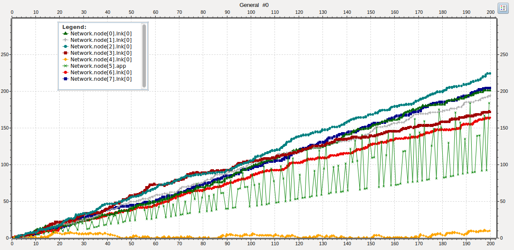
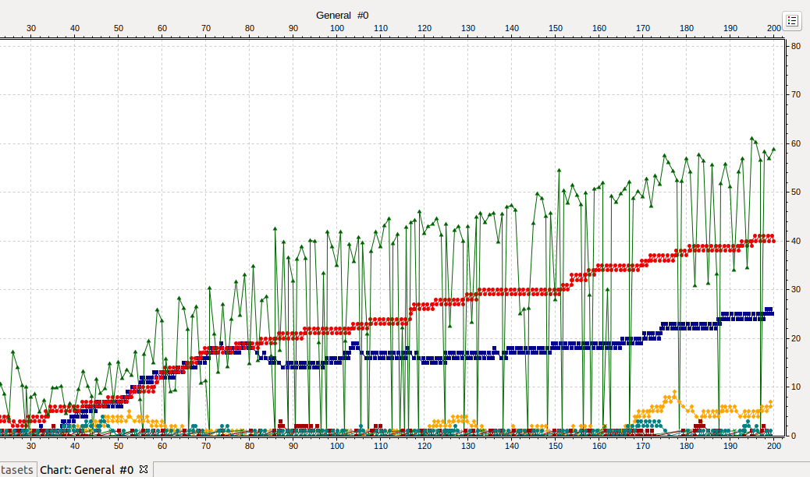
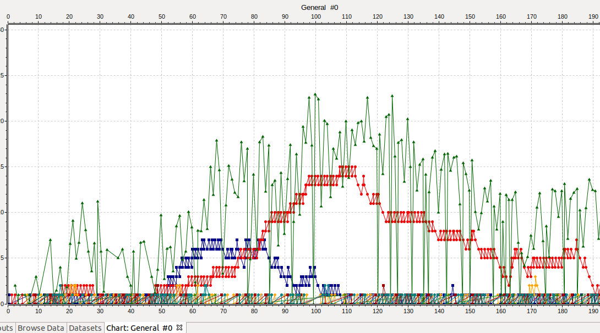

### **Explore y determine a partir de qué valor de interArrivalTime se puede garantizar un equilibrio o estabilidad en la red. Justifique**

Como podemos ver en los gráficos cuanto mas incrementamos el valor de la variable interArrivalTime
mas disminuye la saturación de los buffers de los distintos nodos, sobre todo los nodos 6 y 7 
(representados en el grafico como las lineas rojas y azul respectivamente), estabilizandoce esto al rededor del valor exponencial(7).
Esto es causado porque al haber 7 nodos generando paquetes, todos en la misma dirección, y por la topologia de la red,
cuanto mas cerca del nodo receptor estamos mas cantidad de paquetes recibimos y para lograr un equilibrio el ultimo nodo debería poder 
enviar su paquete junto con un paquete mas por cada nodo generador anterior a el, en este caso un total de 7 paquetes, 
sin sobrepasar su taza de trasmisión, por lo que al tener una taza de generación de paquetes 7 veces menos a la taza de trasmisión esto es posible.

## **Tarea Diseño**

### **Evalúe y compare su estrategia con los casos 1 y 2 de la tarea de análisis** 
.png)
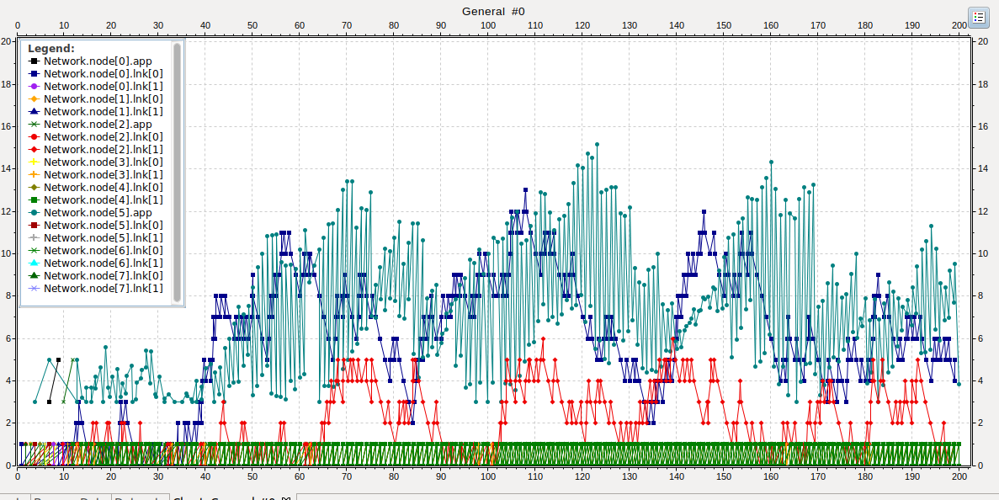

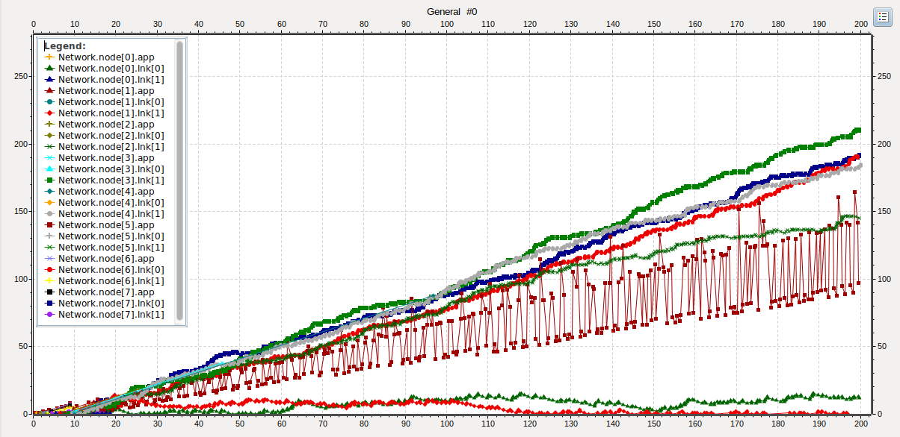

### **¿Cuánto mejoran las métricas? ¿Por qué? ¿Hay loops de enrutamiento?**

Como podemos observar en los gráficos anteriores, en el caso 1 el desempeño de la red mejora significativamente, 
ya que los paquetes enviados desde el nodo 2 ahora toman un comino a trevez de los nodos 3 y 4, evitando el problema de la saturación del nodo 0
y reduciendose tambien el tiempo de llegada al nodo destino.

En el caso 2 la mayor diferencia es que podemos ver es que nuestro estrategia disminuye la carga de paquetes dentro de los buffer de dos nodo 
y no solo de uno como ocurría en el caso original

No se generan loops de enrutamineto

### **Más allá de lo que llegó a implementar en el simulador, ¿Ve alguna manera de mejorar más aún su diseño?**

Nuestro diseño, al haber sido pensado para que funcione en una topologia de anillos, no es lo suficientemente robusto como para desempeñarse bien 
fuera de una topologia donde los nodos que las componen posean mas de dos vecinos, al punto de no poder encontrar nunca el nodo de destino.
Para solucionar esto pensamos en metodos como: 
-utilizar inundación para enviar paquetes de control que mapeen la topologia de nuestra red
-la implementación de tablas de enrutamiento dentro de los nodos que guarda información de por ejemplo el camino por el que llego el 
primer paquete de control enviado por un nodo n, que nos permitiría saber el camino mas rápido por el que enviar paquetes hacia ese nodo.

**----------------------------------------------------------------------------------------------------------------------------------------------**

## **Punto Estrella:**

Intentamos desarrollarlo pero al ver que no funcionaba del todo bien decidimos dejar el lab funcionando sin el punto estrella.

La idea que utilizamos es la de inundación porque nos pareció mas fácil de implementar.

A modo ilustrativo recreamos un ejemplo para poder explicar paso a paso el desarrollo, en donde el Nodo &quot;A&quot; quiere enviar datos al Nodo &quot;Z&quot;.

_**Paso 1 - Nodo Emisor (&quot;A&quot;):**_

La **Capa de APLICACIÓN** del Nodo emisor &quot;A&quot; crea un paquete &quot;hello&amp;salto=1&amp;retardo=0&quot;, setéa el KIND=1 (este valor de KIND nos va servir para avisar a los demás nodos que manden por todas sus aristas salvo por la que vino) y la **Capa de RED** del Nodo &quot;A&quot; manda por todas sus aristas, avisando donde se encuentra (cantidad de saltos que la primera vez sería 1, retardo que al comienzo sería 0) y pidiendo por el Nodo al que está buscando (receptor &quot;Z&quot;).

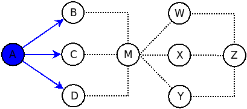

_**Paso 2 - Nodo Intermedio (&quot;M&quot;):**_

Si el paquete llega a un Nodo intermedio &quot;M&quot;, la **Capa de RED** analiza si el paquete está dirigido para si mismo, o si está dirigido para otro.

Si es dirigido para si mismo, genera una respuesta el cual será desarrollado mas abajo. **(\*)**

Si no está dirigido para si mismo (como es en este caso que va dirigido para el Nodo &quot;Z&quot;) y el KIND=1, la **Capa de RED** del Nodo &quot;M&quot; guarda en una tabla **la arista por donde vino** y la **cantidad de saltos,** en otra tabla guarda **la arista por donde vino** y el **tiempo de retardo** desde el Nodo &quot;A&quot; hasta el Nodo &quot;M&quot;. Modifica el paquete **sumando 1 a la cantidad de saltos** y agrega el **nuevo valor de retardo** (eso lo obtenemos con _getArrivalTime()_). Luego reenvía por todas sus aristas salvo por la que ingresó. En caso de tener una sola arista (la misma por la que ingresó el paquete), el paquete se descarta.

Si vuelve a llegar otro paquete al Nodo intermedio &quot;M&quot; con los mismos datos (mismo emisor – en este caso &quot;A&quot; – y mismo receptor – en este caso &quot;Z&quot;-) y el KIND=1, la **Capa de Red** analiza la tabla de saltos de &quot;M&quot; y comparo si la **cantidad de saltos es menor** que la que tengo actualmente, en caso de ser afirmativo, actualizo la tabla cambiando **la arista por donde vino** y la nueva **cantidad de saltos** desde el Nodo &quot;A&quot; hasta el Nodo &quot;M&quot;. En este caso no hace falta actualizar la tabla de retardo, porque si vino un paquete posterior es evidente que el retardo será mayor. Y descartamos el paquete.

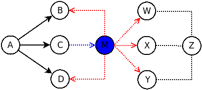

_**Paso 3 - Nodo Destino (&quot;Z&quot;): (\*)**_

Si el paquete llega al Nodo destino (&quot;Z&quot;), la **Capa de RED** actualiza sus tablas y crea un paquete respuesta con &quot;_helloResponse&amp;saltoA=XX&amp;retardoA=YY&amp;saltoZ=1&amp;retardoZ=0_&quot; (donde XX de salto y YY de retardo serían los datos obtuvimos del paquete que llegó) y setéa el KIND=2. Este valor de KIND nos va a servir para informar al resto de los nodos que debe regresar por el camino mas corto (o el camino de menor tiempo de retardo) que haya en la tabla de los Nodos Intermedios. Luego se envía el paquete por la arista por la cual ingresó.

Si vuelve a llegar otro paquete similar solo se compara el tamaño de saltos, de ser menor se actualiza la tabla y se descarta.

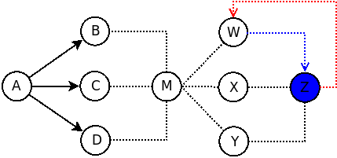

_**Paso 4 - Nodo Intermedio (&quot;M&quot;):**_

Si llega un paquete que va dirigido al Nodo emisor (&quot;A&quot;) y el KIND=2, la **Capa de RED** del Nodo &quot;M&quot; agrega Z a la **tabla de saltos y de retardo** con la arista por donde vino y los valores obtenidos del paquete. Modifica el paquete sumando 1 a &quot;saltoZ&quot; y cambia &quot;retardoZ&quot; por su nuevo valor (eso lo obtenemos con _getArrivalTime()_).

Luego la **Capa de RED** del Nodo &quot;M&quot; revisa la tabla para buscar el camino mas optimo hacia &quot;A&quot; y reenvía el paquete por la arista (LINK) correspondiente.

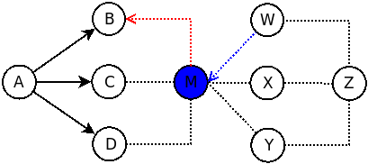

_**Paso 5 - Nodo Emisor (&quot;A&quot;):**_

Cuando llega el paquete del Nodo &quot;Z&quot; al Nodo &quot;A&quot;, la **Capa de RED** actualiza su **tabla de saltos y tabla de retardo** con la arista por donde vino y setéa el valor de la cantidad de saltos y el valor de tiempo de retardo con los valores que obtuvimos del paquete respuesta, se comienzan a armar los paquetes de datos con el KIND=0 (esto para avisar a los demás nodos que son paquetes de datos) y se envía por la arista (LINK) que tengamos seteado en la tabla.

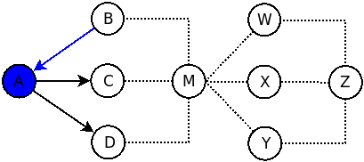
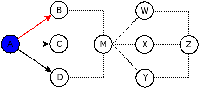

_**Paso 6 - Nodo Intermedio (&quot;M&quot;):**_

Si llega un mensaje para un Nodo que no corresponde a &quot;M&quot; (en este caso va dirigido a &quot;Z&quot;), seteado con el KIND=0, la **Capa de RED** del Nodo &quot;M&quot; solo se encarga de buscar en su tabla y mandar por el camino de menor costo.

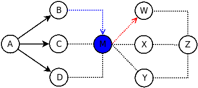

_**Paso 7 - Nodo Destino (&quot;Z&quot;):**_

Si llega un mensaje para el Nodo destino, seteado con el KIND=0, se manda el paquete para la capa de APLICACIÓN.

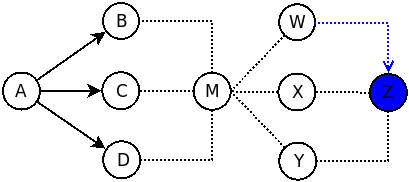

_**Paso 8 - Nodo Emisor (&quot;A&quot;):**_

Transcurrido un tiempo X (aleatorio) se puede volver a generar otro paquete para volver a conocer la estructura de la red por futuras congestiones. En ese caso se setearía el KIND=3 para avisar a los demás nodos que tiene que actualizar la tabla con los nuevos valores y volver a reenviar el paquete por las aristas por donde no vino.

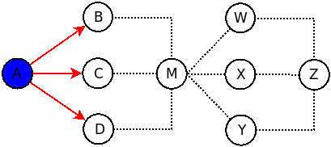

### **CONCLUSIÓN:**
Básicamente ese es el Pseudocodigo que estuvimos tratando de implementar. Tuvimos complicaciones al desarrollarlo por eso decidimos dejar el código como estaba para que al menos funcione correcto con el primer caso. Tampoco nos pusimos de acuerdo si utilizábamos el camino mas corto o el de menor retardo, o como hallar un promedio entre ambos.

La mayor complicación que tuvimos fue el de conocer las Capas de Transporte asociado a cada Nodo. El como obtener sus nombres y conocer la arista por donde ingresó el paquete.
